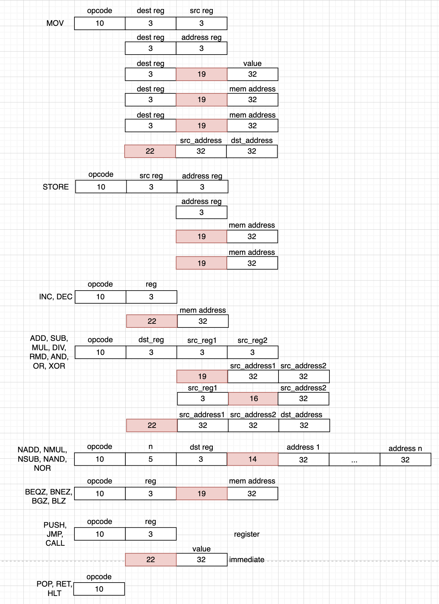

# Lisp. Транслятор и модель

---

- Выполнил: Миронов Иван Николаевич
- `lisp | cisc | neum | mc | tick | binary | stream | mem | cstr | prob2 | cache`


## Язык программирования
Lisp


``` ebnf
<program> ::= <s_expression> | <s_expression> <s_expression>
<s_expression> ::= "(" <atom> | <atom> <s_expression> | <s_expression> <s_expression> | <operation> <s_expression>")"

<atom> ::= <letter> <atom_part> | <number>
<string_atom> = " <atom_part> "
<atom_part> ::= <empty> | <letter> <atom_part> | <digit> <atom_part>
<number> ::= <digit> | <digit> <number>
<letter> ::= "a" | "b" | ... | "z"
<digit> ::= "0" | "1" | ... | "9"
operation := '+' | '-' | '*' | '/' | '%' | '=' | '!=' | '<' | '>' | '<=' | '>='
<empty> ::= " "

comment ::= ; <any symbols>
```
### Семантика
- Стратегия вычисления: вызов по значению (eager)
- Область видимости: локальная в рамках функций
- Типизация: неявная, динамическая
- Литералы: целые числа (int32), строки (cstring)

Операции:
- `(print expr)` - вывести результат выполнения выражения
- `(input)` - ввод строки или числа
- `(cond (condition1 result1) (condition2 result2) ...)` - если `condition_i`=T, выполнить `result_i`. `condition_i=<s_expression> | <atom>`, `result_i=<s_expression>`
- `(defun name (arg1, arg2, ...) body)` - объявление функции с именем `name=<atom>`, аргументами `arg1=<atom>, arg2=<atom>, ...` и телом функции `body=<s_expression>`
- `(call fname)` - вызов функции
- `(begin expr_1 expr_2 ...)` - вычисляет все `expr_i`, результатом выражения является значение `expr_last`
- `(setq var expr)` - вычисляет `expr` и присваивает по адресу переменной `var`
- `(while (cond body) body)` - цикл "пока"
- `(cond (cond_i) (body_i) ...)` - все условия последовательно проверяются, результат выполнения - последнее тело с верным условием
- `(alloc n)` - выделяет `n` машинных слов в куче, возвращает адрес первого слова
- `(store addr value)` - записывает `value` по адресу `addr`
- `(deref addr)` - возвращает слово по адресу `addr`
- `(cons value addr)` - создает новый узел списка в куче 
- `(car addr)` - возвращает адрес первого узла в списка
- `(cdr addr)` - возвращает адрес второго узла в списка
- `(insert value, addr)` - вставляет элемент со значением `value` после узла `addr`
- `(+ <atom1> <atom2>)` -  суммирование операндов
- `(- <atom1> <atom2>)` -  вычитание операндов
- `(/ <atom1> <atom2>)` - деление операндов
- `(* <atom1> <atom2>)` - умножение операндов
- `(% <atom1> <atom2>)` - взятие остатка операндов
- `(and <atom1> <atom2>)` - логическое И операндов
- `(or <atom1> <atom2>)`- логическое ИЛИ операндов
- `(= <atom1> <atom2>)` - проверка, что операнды равны
- `(!= <atom1> <atom2>)`- проверка, что операнды не равны
- `(> <atom1> <atom2>)` - проверка, что операнд1 > операнд2
- `(<= <atom1> <atom2>)` - проверка, что операнд1 <= операнд2


## Орагнизация памяти
- Архитектура Фон Неймана - общая память для инструкций и данных
- Размер машинного слова - 32 бит
- Память адресуется по машинным словам

### Разделы памяти
Память состоит из 4х секций:
- Инструкции хранятся в области `.text`, начиная с адреса 0
- Статические данные (константные строки и переменные) хранятся в области `.data`, начиная с адреса 200
- Динамические данные (динамические строки и списки) хранятся в `heap`, начиная с адреса 500, куча растет к большим адресам. Регистр `RHP` был назначен, как регистр для выделения памяти на куче. Явное управление (alloc).
- фреймы функций (локальные переменные и адреса возврата) хранятся на `stack`, начиная с адреса 1024, стек растет к меньшим адресам. Регистр `RSP` был назначен, как регистр для перемещения по стеку.
```
+-----------------------+
|    000: .text         | Код
+-----------------------+
|    200: .data         | Статические данные
+-----------------------+
|    500: heap (↓)      | Динамическая память
+-----------------------+
|   1024: stack (↑)     | Стек вызовов
+-----------------------+
```

Все глобальные перменные хранятся в области статических данных, локальные переменные хранятся в стеке.
- Константные строки - строки, заданные в программе
- Динамические строки - строки, требующие заранее аллоцированного места на куче, заранее неизвестны
- Списки - структура данных, каждый узел которой состоит из двух машинных слов: [значение][адрес следующего элемента]. 
### Регистры
После вычисления любого из выражений результат кладется в один из свободных регистров. Также регистры используются для временного хранения значений при выполнении операции.
- R_0, ... R_5 - 32-битные регистры общего назначения
- RSP - указатель стека, аппаратно поддерживает инкремент и декремент за 1 такт
- RHP - указатель кучи

## Система команд
- Переменная длина инструкций (несколько машинных слов)
- Инструкции зачастую требуют несколько тактов для выполнения
- MMIO - ввод/вывод происходит с помощью записи/чтения значений из ячеек памяти, являющихся интерфесами к устройствам ввода-вывода
### Кодирование инструкций
Прямое отображение - опкод выступает в роли адреса микрокода

### Адресация
- immediate - значение берется непосредственно из команды
- direct - значение берется из памяти по адресу
- indirect - значение берется из памяти по адресу адреса

Также команда может быть безадресной
### Принцип работы с данными
Каждая арифметическая/логическая операция включают в себя следующие типы:
- Register-to-Register - вычисления проводятся с регистрами и сохраняются в регистр
- Memory-to-Memory - вычисления проводятся с ячейками памяти и сохраняются в память
- Memory-to-Register - вычисления проводятся с ячейками памяти и сохраняются в регистр

Каждая из команд является комбинацией различных типов адресаций и принципов работы с данными.

### Циклы исполнения
- instruction fetch - 4 такта (переход на нужный адрес в памяти микрокоманд)
- operand fetch - 1-4 такта (выборка операндов с нужной адресацией)
- execute - 1 такт (выполнение АЛУ)
- memory access - 1-3 такта


## Транслятор
Транслятор реализован в [translator.py](src/translator.py)

Входные данные:
На вход транслятору подается название файла с исходным кодом на языке Lisp, а также название выходного файла.

Выходные данные:
Транслятор сохраняет бинарный машинный код, а также 16-ричное представление с мнемониками в файлы.

Этапы трансляции программы:
- tokenize - читаем исходных файл, возвращаем поток токенов
- parse - рекурсивный спуск по токенам, возвращаем дерево из узлов `Atom, Exp, ...`
- generate - обход AST и перевод каждой операции в инструкции процессора

## Модель процессора
Модель процессора реализована в [machine.py](src/machine.py)
Микрокод реализован в [microprogram.py](src/microprogram.py)
### Datapath

### Control unit


## Тестирование
Тестирование выполняется при помощи golden test-ов.
- [golden/hello.yml](golden/hello.yml) - напечатать hello world
- [golden/cat.yml](golden/cat.yml) - печатать данные, поданные через ввод (размер ввода потенциально бесконечен)
- [golden/hello_user_name.yml](golden/hello_user_name.yml) - запросить у пользователя его имя, считать его, вывести на экран приветствие
- [golden/sort.yml](golden/sort.yml) - пользователь загружает в систему список чисел и выводит их в отсортированном формате
- [golden/bigint.yml](golden/bigint.yml) - арифметика двойной точности
- [golden/prob2.yml](golden/prob2.yml) - проблема 2 из проекта Эйлера
- [golden/factorial.yml](golden/factorial.yml) - рекурсивное вычисление факториала

Скрипт выполнения golden тестов: [golden_test.py](golden_test.py)
Запуск тестов: `pytest -v`
Обновление тестов: `pytest -v --update-goldens`