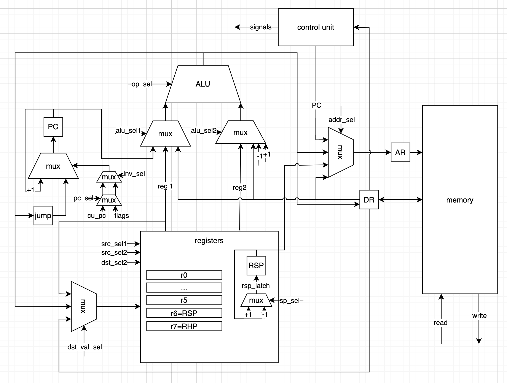
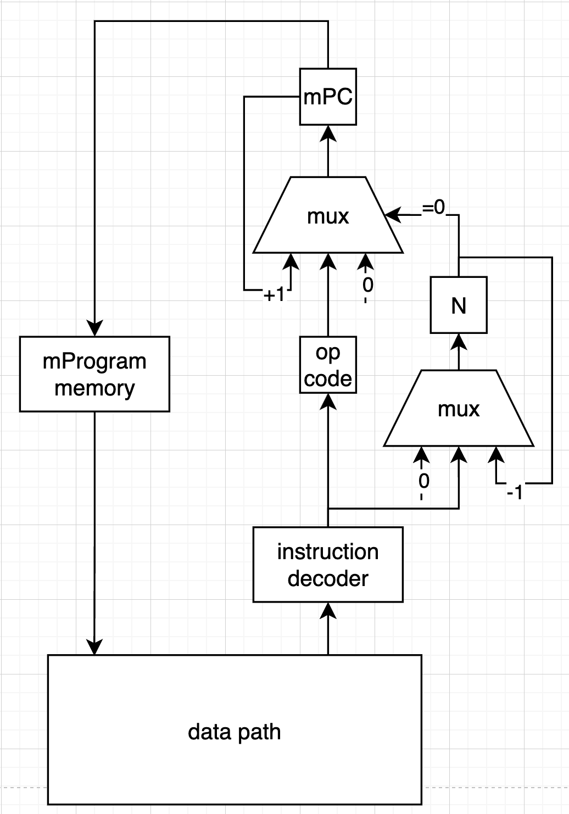

# Lisp. Транслятор и модель

**Table of Contents**

- [Lisp. Транслятор и модель](#lisp-транслятор-и-модель)
    - [Язык программирования](#язык-программирования)

---

- Выполнил: Миронов Иван Николаевич
- `lisp | cisc | neum | mc | tick | binary | stream | mem | cstr | prob2 | cache`


## Язык программирования
Lisp


``` ebnf
<program> ::= <s_expression> | <s_expression> <s_expression>
<s_expression> ::= "(" <atom> | <atom> <s_expression> | <s_expression> <s_expression> | <operation> <s_expression>")"

<atom> ::= <letter> <atom_part> | <number>
<string_atom> = "\"" <atom_part> "\""
<atom_part> ::= <empty> | <letter> <atom_part> | <digit> <atom_part>
<number> ::= <digit> | <digit> <number>
<letter> ::= "a" | "b" | ... | "z"
<digit> ::= "0" | "1" | ... | "9"
operation := '+' | '-' | '*' | '/' | '%' | '=' | '!=' | '<' | '>' | '<=' | '>='
<empty> ::= " "

comment ::= ; <any symbols>
```
### Семантика
Операции выполняются последовательно
Операции:
- `(print <s_expression>)` - вывести результат выполнения выражения
- `(cond (condition1 result1) (condition2 result2) ...)` - если `condition_i`=T, выполнить `result_i`. `condition_i=<s_expression> | <atom>`, `result_i=<s_expression>`
- `(defun name (arg1, arg2, ...) body)` - объявление функции с именем `name=<atom>`, аргументами `arg1=<atom>, arg2=<atom>, ...` и телом функции `body=<s_expression>`
- `(+ <atom1> <atom2> ...)`             -- последовательное суммирование всех операндов
- `(- <atom1> <atom2> ...)`             -- последовательное вычитание всех операндов
- `(/ <atom1> <atom2> ...)`             -- последовательное деление всех операндов
- `(* <atom1> <atom2> ...)`             -- последовательное умножение всех операндов
- `(% <atom1> <atom2> ...)`             -- последовательное взятие остатка всех операндов
- `(and <atom1> <atom2> ...)`           -- последовательное логическое И всех операндов
- `(or <atom1> <atom2> ...)`            -- последовательное логическое ИЛИ всех операндов
- `(= <atom1> <atom2> ...)`             -- проверка, что все операнды равны
- `(<> <atom1> <atom2> ...)`            -- проверка, что все операнды не равны
- `(> <atom1> <atom2> ...)`             -- проверка, что все операнды последовательно уменьшаются
- `(< <atom1> <atom2> ...)`             -- проверка, что все операнды последовательно растут


## Орагнизация памяти
- Архитектура Фон Неймана - общая память для инструкций и данных
- Размер машинного слова не определен (CISC)

## Система команд
- переменная длина инструкций
- инструкции зачастую требуют несколько тактов для выполнения
### Адресация
- непосредственная
- косвенная
- регистровая
- стековая
### Типы команд по операндам
- memory2memory
- register2register
- memory2register
### Набор инструкций
#### Управление памятью
- `push`
- `pop`
- `ld`
- `st`

- `halt` - завершить выполнение программы


<!-- микрокод - должен быть реализован как в железе
то есть микрокод должен располагаться линейно
opcode -> address check lectures

MMIO - wrench like thing
bind IO address in config

устройство процессора - harward risc processor micro arch
- david harris and sara harris -->

## Модель процессора
### Datapath

### Control unit

#TODO
если я захочу мувнуть из reg1 по адрессу reg2?
- mov очень странно спроектирован, переделать
- 
